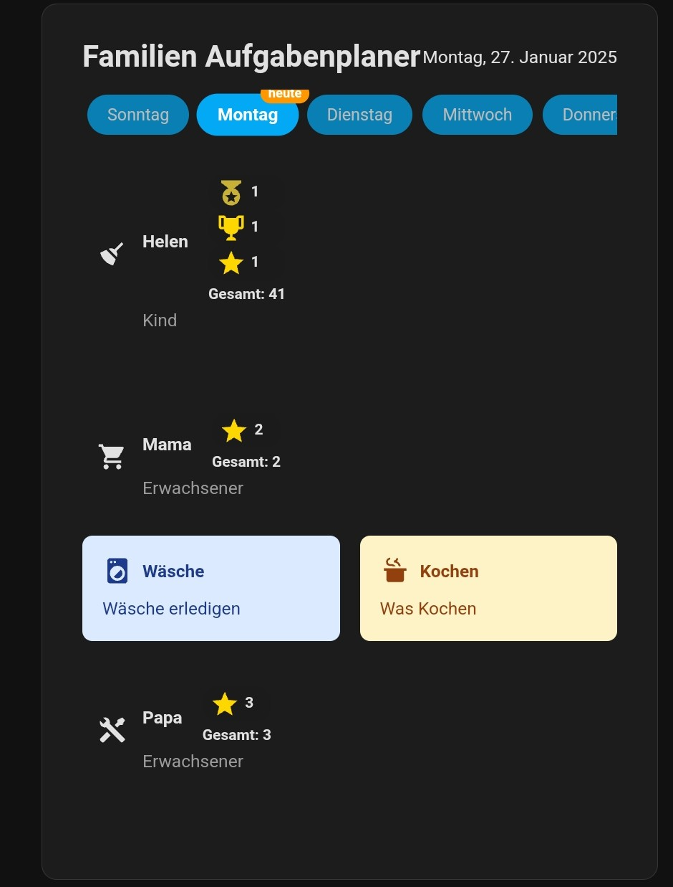

# Home Assistant Family Task Planner Card

## Überblick

Die Task Planner Card ist eine anpassbare benutzerdefinierte Karte für Home Assistant, die ein umfassendes Aufgaben- und Belohnungssystem für Familien oder Haushalte bietet.



## Funktionen

- 🎯 Aufgabenverwaltung für mehrere Benutzer
- 📅 Tagesbasierte Aufgabenplanung
- 🌟 Belohnungssystem mit Sternen, Medaillen und Trophäen
- 👤 Benutzerspezifische Aufgaben und Rollen
- 🔒 Aufgabenabschluss nur für zugewiesene Benutzer
- 🎉 Konfetti und Sound-Feedback bei Aufgabenabschluss

## Installation


### Manuelle Installation

1. Kopiere die Dateien aus dem `dist` Ordner
2. Platziere sie in `config/custom_component/task_planer/`
3. Platziere die Datei im frontend Ordner unter 'config/www/task-planner-card/
4. Füge in der Home Assistant Konfiguration hinzu:
   ```yaml
   frontend:
     extra_module_url:
       - /local/task-planner-card/task-planner-card.js
   ```

## Konfiguration

### Home Assistant Configuration

In der `configuration.yaml`:

```yaml
task_planner:
  users:
    - name: Susi
      role: Kind
      usericon: mdi:user
      tasks:
        - name: Zimmer
          icon: mdi:broom
          days: [0, 1, 4]
          color: blue
          description: 'Zimmer aufräumen und Bett machen'
        - name: Hausaufgaben
          icon: mdi:school
          days: [1, 2, 3, 4, 5]
          color: green
          description: 'Alle Hausaufgaben erledigen'
```

### Lovelace UI Configuration

```yaml
type: custom:task-planner-card
title: Familien Aufgabenplaner
ActiveUser: Helen  # Optional: Zeigt nur Aufgaben für bestimmte Benutzer
```

## Konfigurationsoptionen

### Benutzer-Attribute
- `name`: Name des Benutzers
- `role`: Rolle des Benutzers
- `usericon`: Icon für den Benutzer (optional)

### Aufgaben-Attribute
- `name`: Name der Aufgabe
- `icon`: Icon für die Aufgabe
- `days`: Wochentage (0 = Sonntag, 6 = Samstag)
- `color`: Farbe der Aufgabenkarte
- `description`: Beschreibung der Aufgabe (optional)

## Belohnungssystem

- Jede abgeschlossene Aufgabe gibt einen Stern
- Sterne werden in Kategorien umgewandelt:
  - 10 Sterne = 1 Medaille
  - 30 Sterne = 1 Trophäe 

## Technische Details

- Entwickelt mit LitElement
- Vollständig in Home Assistant integriert
- Responsive Design
- Unterstützt mehrere Benutzer und Aufgaben

## Beitrag

Beiträge sind willkommen! Bitte öffnen Sie Issues oder senden Pull Requests.

## Support

Bei Fragen oder Problemen öffnen Sie bitte einen GitHub Issue.
